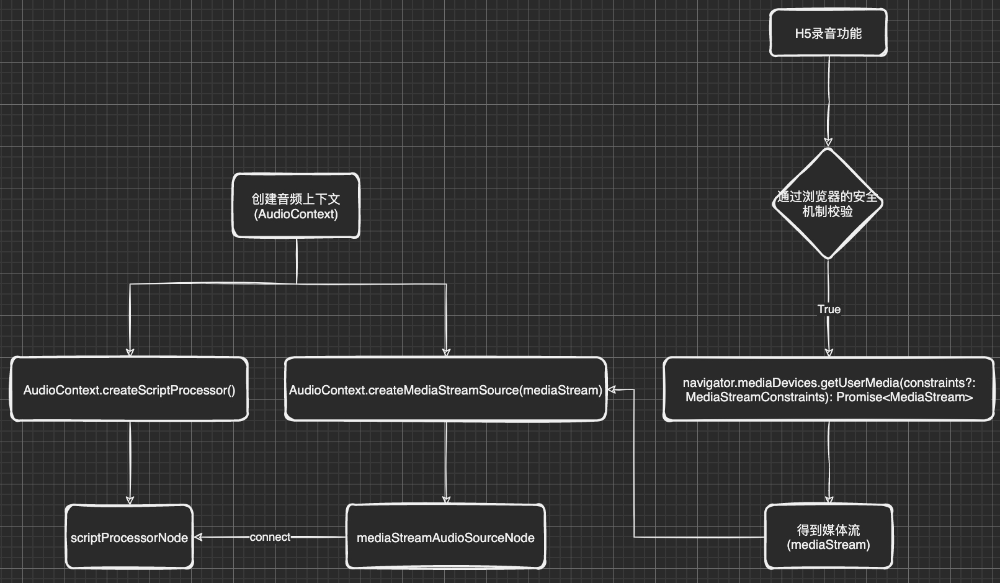
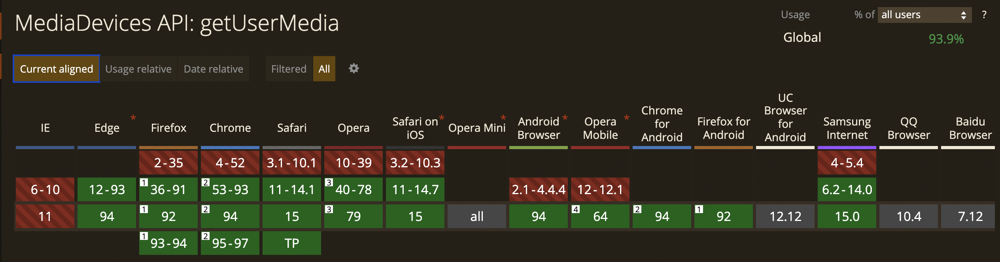
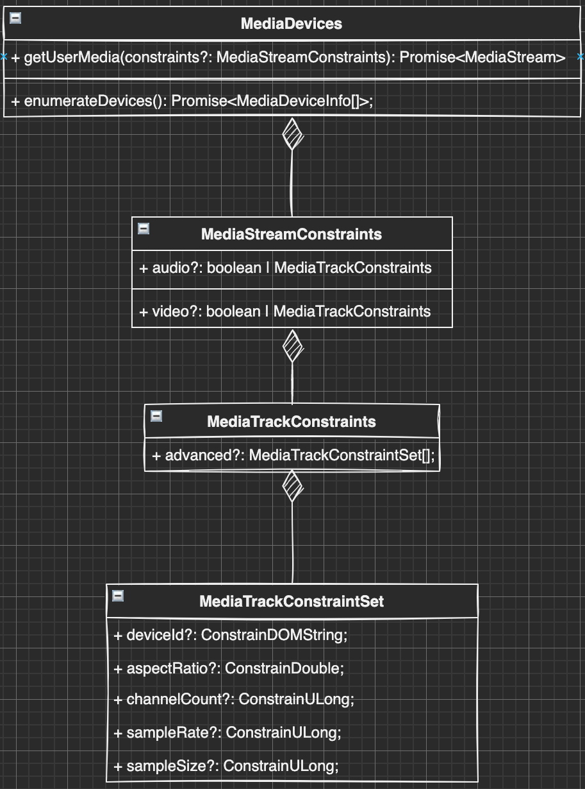
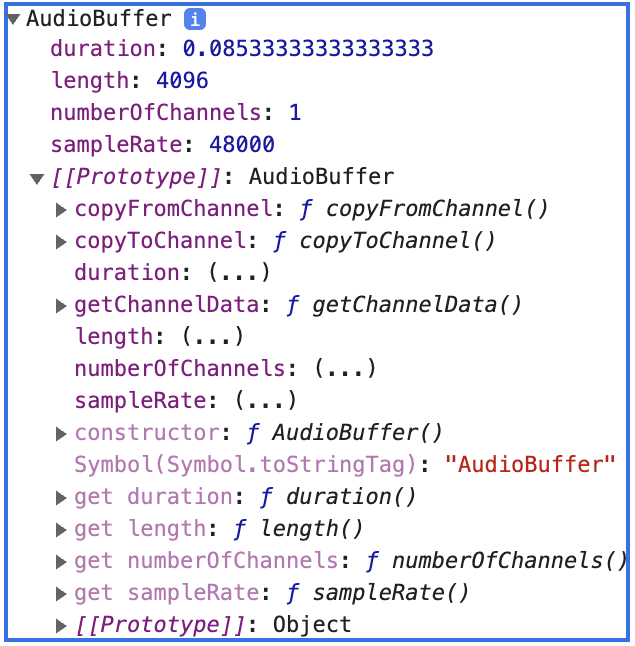
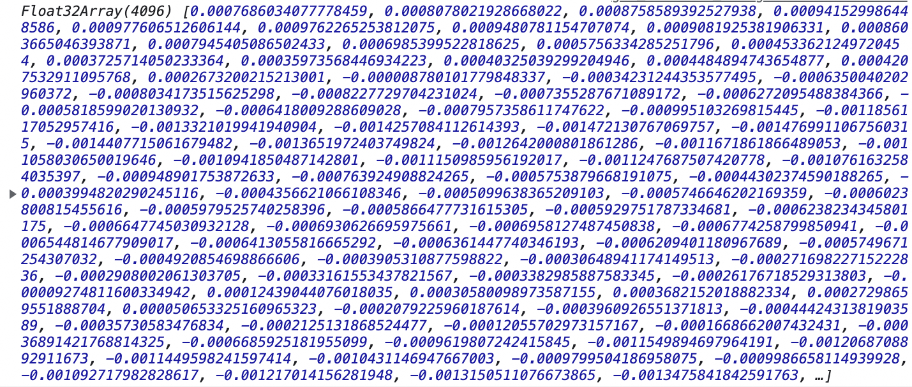

### H5(Webview) 音频录制功能梳理

功能背景: 
  - Taro 多端开发
  - H5 网页端

功能目标:
  - Taro.getRecorderManager()的规范实现实时录音传输数据 [Taro.getRecorderManager()的接口规范](https://developers.weixin.qq.com/miniprogram/dev/api/media/recorder/RecorderManager.html)
  - 实时发送音频格式为"采样频率16000Hz、采样位数16bits、单声道PCM格式"的数据

*采样频率、采样位数和声道信息已经在上一篇文章中有所提及，PCM格式是什么呢？*

> 音频的裸数据格式就是脉冲编码调制（Pulse Code Modulation，PCM）数据。
> 描述一段PCM数据一般需要以下几个概念：量化格式（sampleFormat）、采样率（sampleRate）、声道数（channel）。 --- [音视频基础知识---音频编码格式](https://zhuanlan.zhihu.com/p/69901270)

实际上我们一会儿调用的方法返回的数据就是PCM格式的。

#### 录音功能: 获取物理设备的音频信息并且用JS可控制

从调用录制方法到可以获取数据的流程图:
> window.navigator.mediaDevices.getUserMedia(constraints?: MediaStreamConstraints): Promise<MediaStream>



**getUserMedia方法的安全机制: 该方法只能在https协议或者域名为127.0.0.1/localhost中被访问到！**

`getUserMedia()`方法在浏览器中的支持情况:



*PS:WKwebview: 14.3版本开始支持，且首次进入网页无法访问到`getUserMedia`函数，第二次可以访问，经过与IOS官方的工作人员沟通，确认是浏览器本身的BUG --- 2021-09-17*

##### getUserMedia的配置信息 - MediaStreamConstraints

> The MediaStreamConstraints dictionary is used when calling getUserMedia() to specify what kinds of tracks should be included in the returned MediaStream, and, optionally, to establish constraints for those tracks' settings.  --- [MediaStreamConstraints](https://developer.mozilla.org/en-US/docs/Web/API/MediaStreamConstraints)

看到这个地方我就觉得目标中要求的音频格式就是个配置信息的事儿，这和Taro的规范差不多嘛。

**具体能配置哪些信息呢？我这里有一张图片。👇**



```ts
/**
 * 实际上getUserMedia的方法能实现音视频录制、屏幕共享等功能，
 * 只是在各个浏览器中支持的有很大的差别，这里列举的配置参数只是冰山一角。
 * 详细配置信息链接内容可以在文章最后的相关连接中查找到；
 */
interface MediaTrackConstraintSet {
    deviceId?: ConstrainDOMString; // 通用的录制设备ID； 
    aspectRatio?: ConstrainDouble; // 视频录制时的视频的纵横比；
    channelCount?: ConstrainULong; // 音频录制时的声道数；
    sampleRate?: ConstrainULong;   // 音频录制时的采样频率；
    sampleSize?: ConstrainULong;   // 音频录制时的采样位数；
}
```

看到这个接口我们能发现，配置信息中包含声道数、采样频率、采样位数。

##### 调用getUserMedia方法，获取媒体流

```ts
window.navigator.mediaDevices.getUserMedia({ audio: { channelCount: 1, sampleRate: 16000, sampleSize: 16 } }).then((stream)=>{
  console.log(stream)
})

interface MediaStream extends EventTarget {
    readonly active: boolean;
    readonly id: string;
    onaddtrack: ((this: MediaStream, ev: MediaStreamTrackEvent) => any) | null;
    onremovetrack: ((this: MediaStream, ev: MediaStreamTrackEvent) => any) | null;
    addTrack(track: MediaStreamTrack): void;
    clone(): MediaStream;
    getAudioTracks(): MediaStreamTrack[];
    getTrackById(trackId: string): MediaStreamTrack | null;
    getTracks(): MediaStreamTrack[];
    getVideoTracks(): MediaStreamTrack[];
    removeTrack(track: MediaStreamTrack): void;
    addEventListener<K extends keyof MediaStreamEventMap>(type: K, listener: (this: MediaStream, ev: MediaStreamEventMap[K]) => any, options?: boolean | AddEventListenerOptions): void;
    addEventListener(type: string, listener: EventListenerOrEventListenerObject, options?: boolean | AddEventListenerOptions): void;
    removeEventListener<K extends keyof MediaStreamEventMap>(type: K, listener: (this: MediaStream, ev: MediaStreamEventMap[K]) => any, options?: boolean | EventListenerOptions): void;
    removeEventListener(type: string, listener: EventListenerOrEventListenerObject, options?: boolean | EventListenerOptions): void;
}
```

> MediaStream 接口是一个媒体内容的流。一个流包含几个轨道，比如视频和音频轨道。 --- [媒体流(MediaStream)](https://developer.mozilla.org/zh-CN/docs/Web/API/MediaStream)

仔细分析这个媒体流的接口信息，其实并没有直接给我返回我想要的音频数据，那我们怎么才能获取到我们需要的音频数据呢？

##### AudioContext.createMediaStreamSource()&&AudioContext.createScriptProcessor()

```ts
async function start(option) {
  const mediaStream = await window.navigator.mediaDevices.getUserMedia({ audio: { channelCount: option.channelCount, sampleRate: option.sampleRate, sampleSize: option.sampleSize } })
  const audioContext = new window.AudioContext()
  const mediaStreamAudioSourceNode = audioContext.createMediaStreamSource(mediaStream)
  const scriptProcessorNode = audioContext.createScriptProcessor(option.bufferSize, option.channelCount, option.channelCount)
  // 需要连到扬声器消费掉outputBuffer，process回调才能触发
  // 并且由于不给outputBuffer设置内容，所以扬声器不会播放出声音
  scriptProcessorNode.connect(audioContext.destination)
  scriptProcessorNode.onaudioprocess = function(event: AudioProcessingEvent){
    const audioBuffer = event.inputBuffer
    console.log('成功获取了音频数据')
    // 操作音频数据
  }
  this.mediaStreamAudioSourceNode.connect(scriptProcessorNode)
}

const option = {
  channelCount: 1,
  sampleRate: 16000,
  sampleSize: 16,
  bufferSize: 4096
}
start(option);
```
> MediaStreamAudioSourceNode 接口代表一个音频接口，是WebRTC MediaStream (比如一个摄像头或者麦克风)的一部分。是个表现为音频源的AudioNode。 --- [MediaStreamAudioSourceNode](https://developer.mozilla.org/zh-CN/docs/Web/API/MediaStreamAudioSourceNode)
> ScriptProcessorNode 接口允许使用JavaScript生成、处理、分析音频。 --- [ScriptProcessorNode](https://developer.mozilla.org/zh-CN/docs/Web/API/ScriptProcessorNode)
> ScriptProcessorNode.onaudioprocess 函数触发的时机以及AudioProcessingEvent的接口信息👇
> The Web Audio API AudioProcessingEvent represents events that occur when a ScriptProcessorNode input buffer is ready to be processed. --- [AudioProcessingEvent - property](https://developer.mozilla.org/en-US/docs/Web/API/AudioProcessingEvent#properties)


#### 音频数据处理: 处理获取到的音频数据，使之可以直接播放

上一节我们实现了目标一，可以按照Taro的相关规范实现录音方法，接下来我们看看目标二。
**实时发送音频格式为"采样频率16000Hz、采样位数16bits、单声道PCM格式"的数据**

- 采样频率: 16000Hz
- 采样位数: 16bits
- 单声道
- PCM

有以上四个关键的指标，除了浏览器API本身就返回的是PCM，剩下的三个参数实际上我们在调用方法的时候已经设置了，接下来我们看一下获取到的`ArrayBuffer`是否是我们想要的样子？

但是我们获取到的对象好像是`AuidoBuffer`，那我们又怎么能获取到我们想要的`ArrayBuffer`呢？

我们来看一下这个`AudioBuffer`对象的具体信息。

> AudioBuffer接口表示存在内存里的一段短小的音频资源； -- [AudioBuffer](https://developer.mozilla.org/zh-CN/docs/Web/API/AudioBuffer)

```ts
interface AudioBuffer {
    readonly duration: number;
    readonly length: number;
    readonly numberOfChannels: number;
    readonly sampleRate: number;
    copyFromChannel(destination: Float32Array, channelNumber: number, bufferOffset?: number): void;
    copyToChannel(source: Float32Array, channelNumber: number, bufferOffset?: number): void;
    getChannelData(channel: number): Float32Array;
}
```

- duration - 存储在缓存区的PCM数据的时长
- length - 存储在缓存区的PCM数据的采样帧率
- numberOfChannels - 存储在缓存区的PCM数据的通道数
- sampleRate - 存储在缓存区的PCM数据的采样率
- getChannelData(channel: number): Float32Array - 返回一个 `Float32Array`，包含了频道的PCM数据。

在`AudioBuffer`中，不但能获取到音频数据，我们还能看到数据的部分属性，按照以上代码录制音频的数据信息可以见下图👇



我们先看一下音频属性，我们回忆一下设置的属性: 
- 采样频率: 16000Hz
- 采样位数: 16bits
- 单声道

实际的音频属性:
- 单声道
- 采样频率: 48000
- 采样位数未知

我们设置了三个属性，可以确定声道数起作用了，但采样频率并不是我们想要的。对于`getUserMedia`方法的`sampleRate`的配置，网上有的人表示是Chrome浏览器根本没有实现，有的表示是一个Chrome已知的bug，有的表示W3C的规范就不明确。

##### 降低采样频率

采样频率是单位时间内从连续信号中提取并组成离散信号的采样个数。现在的情况是在单位时间内采样了48000个，我们希望只采样16000个。那我们从获取到的48000个里面每三个里面拿出一个不就是我们想要的16000个了吗。

```ts
// 降低采样频率
function interpolateArray(data: Float32Array, newSampleRate: number, oldSampleRate: number) {
  const fitCount = Math.round(data.length * (newSampleRate / oldSampleRate));
  const newData = new Float32Array(fitCount);
  const springFactor = (data.length - 1) / (fitCount - 1)
  newData[0] = data[0];
  for (let i = 1; i < fitCount - 1; i++) {
    const tmp = i * springFactor;
    const before = Math.floor(tmp);
    const after = Math.ceil(tmp);
    const atPoint = tmp - before;
    newData[i] = linearInterpolate(data[before], data[after], atPoint);
  }
  newData[fitCount - 1] = data[data.length - 1];
  return newData;
}

function linearInterpolate(before, after, atPoint) {
  return before + (after - before) * atPoint;
}
```

##### 转换采样位数

我们再来看一下采样位数，`AudioBuffer`当中并没有给我们明确的属性来表示采样位数的大小，但是我们可以从`getChannelData`方法的返回值看出；`getChannelData`方法的返回值是一个`Float32Array`的PCM数据，`Float32Array`是一个32位浮点数的二进制数组，**所以获取到的是一个32位的数据。**

我们把他打印出来👇



**那我们获取到的这个数据到底表示的是什么呢?**它是采样采来的表示声音的强弱，声波被麦克风转换为不同强度的电流信号，这些数字就代表了信号的强弱。它的取值范围是[-1, 1]，表示一个相对比例。

那怎么能转换成16位的数据呢？

16位表示的范围是 [-32768, +32767]，最大值是32767即0x7FFF，最小值是-32768即0x8000，录音数据的取值范围是[-1, 1]，表示相对比例，用这个比例相乘就是实际要存储的值。

```ts
// Float32Array to Int16Array
function floatTo16BitPCM(data: Float32Array): Int16Array {
  let length = data.length;
  let result = new Int16Array(length);
  for (let i = 0; i < length; i++) {
    result[i] = data[i] < 0 ? data[i] * 0x8000 : data[i] * 0x7FFF;;
  };
  return result
}
```
*转换采样位数、降低采样频率的方法都是在`onaudioprocess`方法中调用的，每秒调用的次数过多，在WKwebview中表现卡顿，采样的音频质量很差。解决方式：可以使用web worker处理音频；把audioBuffer发送给web worker，处理完以后再传输回网页中。*

```ts
scriptProcessorNode.onaudioprocess = function(event: AudioProcessingEvent){
  const audioBuffer = event.inputBuffer
  this.currentRecorderSampleRate = audioBuffer.sampleRate
  if (Object.prototype.hasOwnProperty.call(this.option, 'frameSize')) {
    const newSampleRateBuffer = interpolateArray(audioBuffer.getChannelData(0), this.defaultOption.sampleRate, audioBuffer.sampleRate)
    const int16PCMBuffer = floatTo16BitPCM(newSampleRateBuffer)
    // frameRecordedCallback 为规范中规定的回调函数
    this.frameRecordedCallback && this.frameRecordedCallback({ frameBuffer: event.data.buffer, isLastFrame: false })
  }
}
```

至此我们就可以获取到采样频率为16000Hz、采样位数为16bits、单声道的PCM数据了。

##### 我们如何播放录制的音频呢？

我们已经获取到了所有的PCM数据，但是`<audio>`标签不支持播放PCM格式的音频，所以我们需要把刚刚获取到的`Float32Array`合并、转码、生成链接就可以实现最简单的播放功能了。

###### 合并Float32Array

回到`onaudioprocess`方法中，我们把这里获取到的数据保存到一个数组`monoDataList: Float32Array[]`中，停止录制的时候再统一处理。

```ts
scriptProcessorNode.onaudioprocess = function(event: AudioProcessingEvent){
  const audioBuffer = event.inputBuffer
  this.currentRecorderSampleRate = audioBuffer.sampleRate

  this.setChannelData(audioBuffer)
  this.setTotalDuration(audioBuffer.duration) 

  if (Object.prototype.hasOwnProperty.call(this.option, 'frameSize')) {
    const newSampleRateBuffer = interpolateArray(audioBuffer.getChannelData(0), this.defaultOption.sampleRate, audioBuffer.sampleRate)
    const int16PCMBuffer = floatTo16BitPCM(newSampleRateBuffer)
    // frameRecordedCallback 为规范中规定的回调函数
    this.frameRecordedCallback && this.frameRecordedCallback({ frameBuffer: event.data.buffer, isLastFrame: false })
  }
}

// ...

setChannelData(audioBuffer: AudioBuffer) {
  // 双声道 存储数据的方式
  if (this.defaultOption.numberOfChannels === 2) {
    let leftChannelData = audioBuffer.getChannelData(0),
      rightChannelData = audioBuffer.getChannelData(1);

    this.leftDataList.push(leftChannelData.slice(0));
    this.rightDataList.push(rightChannelData.slice(0));
  } else {
    // 单声道存储数据的方式
    this.monoDataList.push(audioBuffer.getChannelData(0).slice(0))
  }
}

// 设置总的录音时长
setTotalDuration(duration: number) {
  this.totalDuration += duration
}
```

停止录制的时候我们需要整理一下数据，在停止录制的回调函数`onStop`中返回音频的播放地址。

```ts
stop(): void {
  this.mediaStream?.getAudioTracks()[0].stop();
  this.mediaStreamAudioSourceNode?.disconnect();
  this.scriptProcessorNode?.disconnect();
  const allData: Float32Array = this.getChannelData()
  const bitDepth = this.format === 3 ? 32 : 16
  const wavBuffer: ArrayBuffer = encodeWAV(allData, this.format, this.currentRecorderSampleRate, thisdefaultOption.numberOfChannels!, bitDepth)
  this.stopCallback && this.stopCallback({ duration: this.totalDuration, fileSize: wavBuffer.byteLength,tempFilePath: this.arrayBufferToBase64(wavBuffer) })
}

getChannelData() {
  if (this.defaultOption.numberOfChannels === 2) {
    return this.interleaveLeftAndRight(this.mergeArray(this.leftDataList), this.mergeArray(this.rightDataList))
  } else {
    return this.mergeArray(this.monoDataList)
  }
}

arrayBufferToBase64(arrayBuffer: ArrayBuffer) {
  let binary = '';
  const bytes = new Uint8Array(arrayBuffer);
  let len = bytes.byteLength;
  for (let i = 0; i < len; i++) {
    binary += String.fromCharCode(bytes[i]);
  }
  return `data:audio/${this.defaultOption.format};base64,${window.btoa(binary)}`;
}
```

```ts
// 方法来源于网络
// audioBufferToWav.ts
export function encodeWAV(samples: Float32Array, format: number, sampleRate: number, numChannels: number, bitDepth: number) {
  var bytesPerSample = bitDepth / 8
  var blockAlign = numChannels * bytesPerSample

  var buffer = new ArrayBuffer(44 + samples.length * bytesPerSample)
  var view = new DataView(buffer)

  /* RIFF identifier */
  writeString(view, 0, 'RIFF')
  /* RIFF chunk length */
  view.setUint32(4, 36 + samples.length * bytesPerSample, true)
  /* RIFF type */
  writeString(view, 8, 'WAVE')
  /* format chunk identifier */
  writeString(view, 12, 'fmt ')
  /* format chunk length */
  view.setUint32(16, 16, true)
  /* sample format (raw) */
  view.setUint16(20, format, true)
  /* channel count */
  view.setUint16(22, numChannels, true)
  /* sample rate */
  view.setUint32(24, sampleRate, true)
  /* byte rate (sample rate * block align) */
  view.setUint32(28, sampleRate * blockAlign, true)
  /* block align (channel count * bytes per sample) */
  view.setUint16(32, blockAlign, true)
  /* bits per sample */
  view.setUint16(34, bitDepth, true)
  /* data chunk identifier */
  writeString(view, 36, 'data')
  /* data chunk length */
  view.setUint32(40, samples.length * bytesPerSample, true)
  if (format === 1) { // Raw PCM
    floatTo16BitPCM(view, 44, samples)
  } else {
    writeFloat32(view, 44, samples)
  }

  return buffer
}

function writeFloat32(output, offset, input) {
  for (var i = 0; i < input.length; i++, offset += 4) {
    output.setFloat32(offset, input[i], true)
  }
}

function floatTo16BitPCM(output, offset, input) {
  for (var i = 0; i < input.length; i++, offset += 2) {
    var s = Math.max(-1, Math.min(1, input[i]))
    output.setInt16(offset, s < 0 ? s * 0x8000 : s * 0x7FFF, true)
  }
}

function writeString(view, offset, string) {
  for (var i = 0; i < string.length; i++) {
    view.setUint8(offset + i, string.charCodeAt(i))
  }
}
```

### 相关链接
[如何实现前端录音功能 - 知乎](https://zhuanlan.zhihu.com/p/43581133)
[Change sample rate of AudioContext (getUserMedia) - StackOverFlow](https://stackoverflow.com/questions/30031561/change-sample-rate-of-audiocontext-getusermedia)
[MediaStreamConstraints - MDN](https://developer.mozilla.org/en-US/docs/Web/API/MediaStreamConstraints)
[MediaTrackConstraints - MDN](https://developer.mozilla.org/en-US/docs/Web/API/MediaTrackConstraints#browser_compatibility)